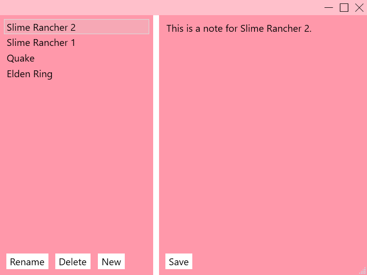

## Concept
GamePlan is a desktop application for helping me keep track of things for my work
on YouTube. Currently it supports a list of games with their associated notes.
I plan on adding additional features like sorting by rated interest and
audio mixing notes to help me when editing footage.

## Technology
This is a WPF application built on .NET and utilizing MongoDB for data storage and retrieval.